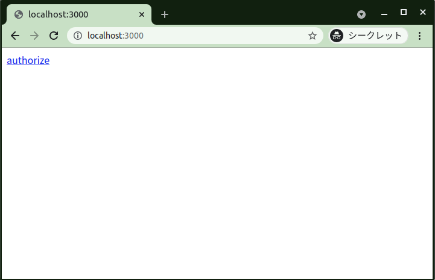
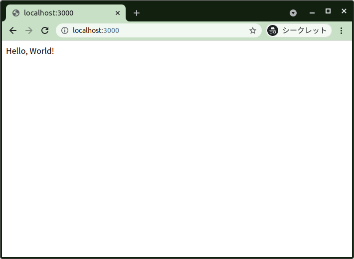
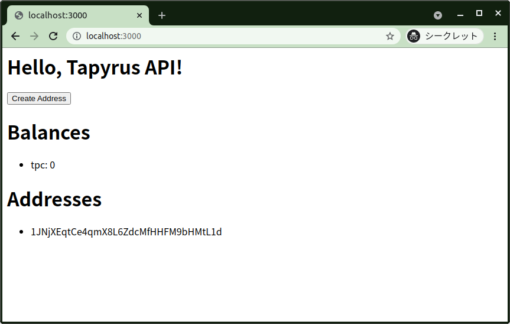
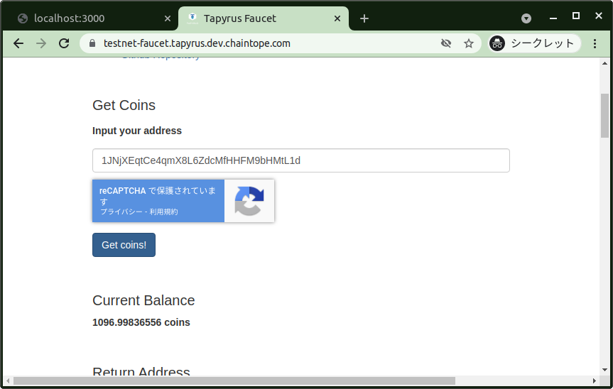
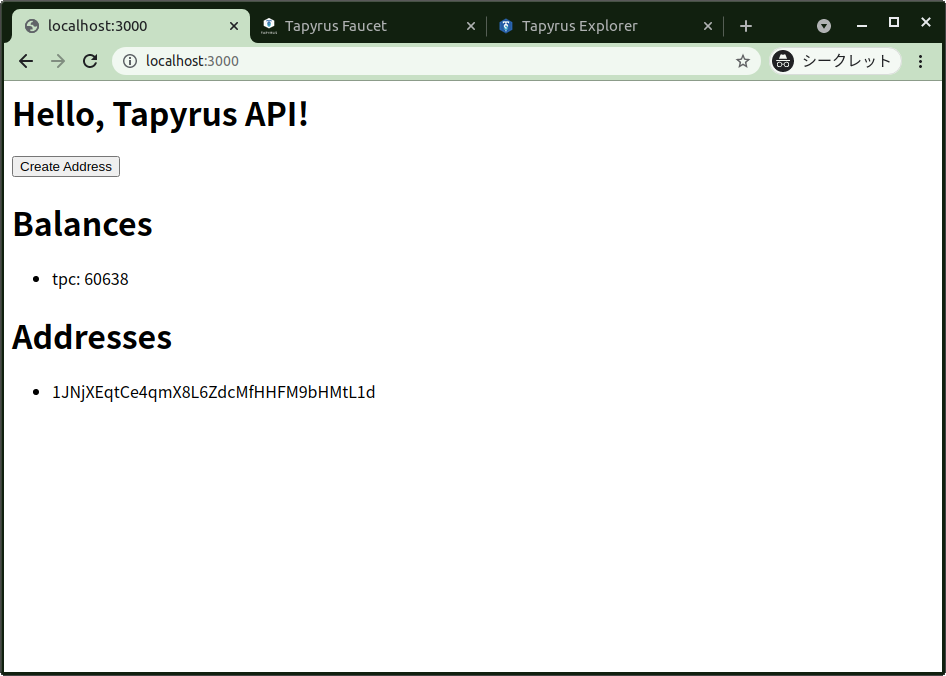
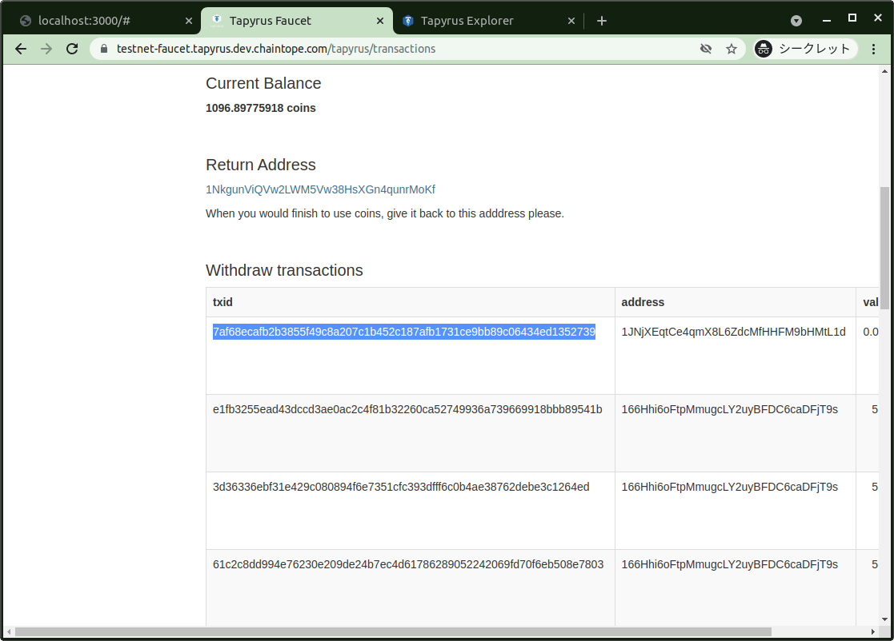
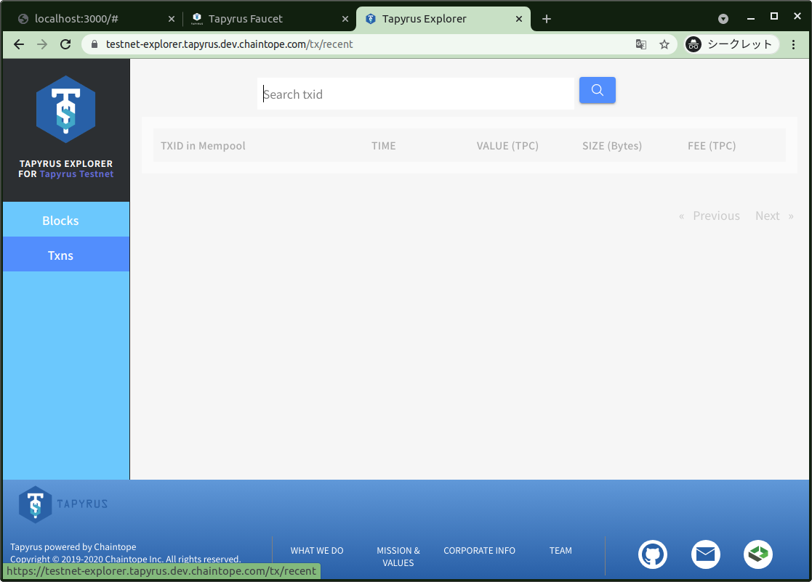
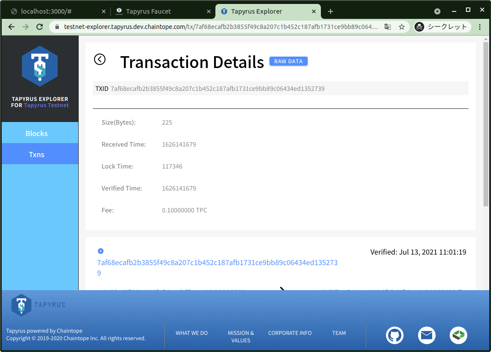
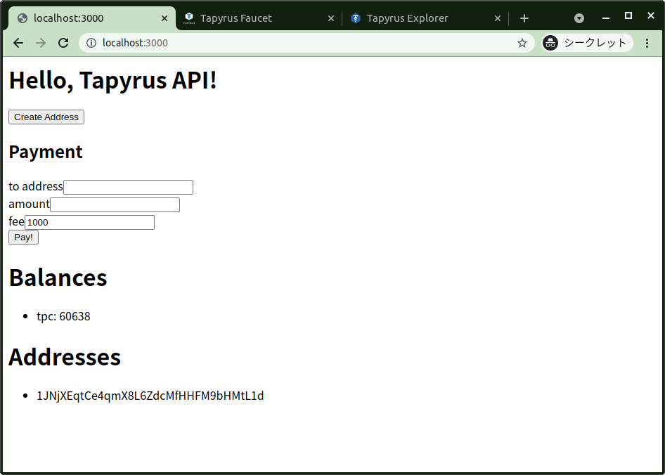
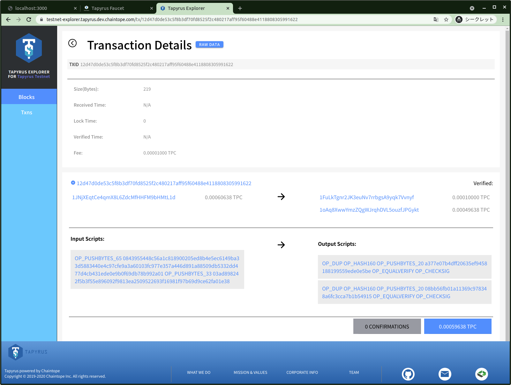

# Getting Started

ここでは Tapyrus API を利用した JavaScript のウェブアプリケーション開発の始め方について解説をします。 前提として Tapyrus ブロックチェーンや Tapyrus API の概要への理解が必要です。
未読の方は先に [Tapyrus API ドキュメント](https://doc.api.tapyrus.chaintope.com) のイントロダクションをご覧ください。

## このドキュメントのゴール

* OpenID Connect を使った認証と、Tapyrus API へのユーザー登録の方法を理解する。
* Access Token を利用し、Tapyrus API へリクエストを送る方法を理解する。
* Tapyrus API ユーザーのウォレットに TPC を供給して、トランザクションを発行する API の準備の方法を理解する。
* トランザクションの発行をおこなう API を利用し、実際にブロックチェーンに作用する API の使い方を理解する。
* Tapyrus API で行った操作によって作られたトランザクションをエクスプローラーで確認する方法を理解する。

## 作成するプロジェクトの構成

JavaScript を使ったウェブアプリケーションの構築を通して、ゴールの達成を目指します。

作成するプロジェクトでは、Tapryus API を利用して、受金するためのアドレスの取得、Tapyrus ブロックチェーンのネイティブコインである TPC の送金、残高の確認を行えるウェブアプリケーションを構築します。

なお、完成したプロジェクトは [example-app](./example-app) にあります。

### 対象とするブロックチェーン

このドキュメントでは testnet を利用します。 testnet は誰でも利用可能な動作の確認用のネットワークであり、予告なくリセットされる可能性があります。 利用に必要な TPC は faucet から取得できます。

* [Testnet Explorer](https://testnet-explorer.tapyrus.dev.chaintope.com)
* [Testnet Faucet](https://testnet-faucet.tapyrus.dev.chaintope.com)

### OpenID Connect を使った認証

また、構築の中では OpenID Connect を使った認証処理も構築します。 API へのアクセスに必要なアクセストークンを OpenID Connect の Authorization Code Flow を通して取得します。
ここでは OpenID Provider(OP) のサンプルとして https://accounts.google.com を利用します。 OP へのアプリケーションやリダイレクトURLの登録の方法は、利用する OP
のドキュメントに従ってください。

OpenID Connect の詳細な情報は以下を参照してください。 この Getting Started ドキュメントはOpenID Connect
への詳しい理解がなくとも構築できるようにしていますが、ご参照いただければより正確な理解が得られます。

* [OpenID Connect Core 1.0 日本語訳](http://openid-foundation-japan.github.io/openid-connect-core-1_0.ja.html)

Google を OP として利用される方はまず [Google Cloud Platform のコンソール](https://console.cloud.google.com/home/dashboard) から
アプリケーションを追加し、以下のページの手順に従ってクレデンシャルの入手を行ってください。リダイレクトURLの設定は以降の手順の中で実施します。

* [OpenIDコネクト | Google Identity Platform | Google Developers](https://developers.google.com/identity/protocols/oauth2/openid-connect)

## 1. 新しいプロジェクトの作成

新しいプロジェクトを作成して、最初の Tapyrus API プロジェクトを始めましょう。

    $ mkdir example-app
    $ cd ./example-app
    $ npm init 

`npm init` を実行すると、プロジェクト名の入力を求められますが、ここではすべてエンターを押して進めてください。

ウェブアプリケーションフレームワークである [Express](https://expressjs.com/ja/) を利用しますのでインストールします。

    $ npm install express --save

初めに以下のシンプルなサーバープログラムを `index.js` というファイル名で作成しサーバーの起動を確認しましょう。

```javascript
const express = require('express');
const app = express();
const port = 3000;

app.listen(port, async () => {
  console.log(`Example app listening at http://localhost:${port}`)
});

app.get('/', async (req, res) => {
  res.send('Hello, World!');
});
```

以下のコマンドでサーバーを起動します。

    $ node index.js

http://localhost:3000 へアクセスし、「Hello, World!」と表示されれば成功です。

## 2. OpenID Connect による認証

認証には openid-client という NPM パッケージを利用します。

* [openid-client](https://www.npmjs.com/package/openid-client)

プロジェクトに追加します。

    $ npm install openid-client --save

次に、`index.js` に認証のためのコードを追加します。

### 2.1. openid-client の読み込み

以下のコードを `index.js` の express のロードの次に追加して下さい。

```javascript
// ...
const port = 3000

// ここから下を 'index.js' へ追加
const {Issuer, generators} = require('openid-client');
const code_verifier = generators.codeVerifier();
```

### 2.2. OpenID Provider とクレデンシャルの情報をセットする

以下のコードを 2.1. で追加したコードの下に追加してください。

```javascript
// OpenID Connect のクライアントクレデンシャルを設定します。自身の環境に合わせて修正してください。
const issuer = 'ここには issuer (OP)の情報を入力します';
const client_id = 'ここには OP から提供された client_id の情報を入力します';
const client_secret = 'ここには OP から提供された client_secret の情報を入力します';
```

ここで宣言した各定数の値は、実際のあなたの環境に合わせた値に置き換えてください。

OP に Google を利用する場合は以下のように Issuer には https://accounts.google.com を指定します。

```javascript
const issuer = 'https://accounts.google.com';
```

`client_id` と `client_secret` は Google Cloud Platform のコンソールから入手した値を入力してください。入手法については以下のページを参考にしてください。

* [OpenIDコネクト | Google Identity Platform | Google Developers](https://developers.google.com/identity/protocols/oauth2/openid-connect)

### 2.3. oidcClient を作成する

`app.listen(...)` はサーバーを起動し、指定したポートで接続を待ち受けるようにします。 この第２引数に関数を渡すことでサーバーが起動したタイミングに処理をフック出来ます。

ここで oidcClient オブジェクトを作成し、OIDC 認証の準備をします。

2.2 で追加したコードの下に以下の変数を宣言します。 これらは、サーバーのアクションをまたいで保持する必要があるオブジェクトを格納するために使います。

```javascript
let googleIssuer;
let oidcClient;
let accessToken;
```

```javascript
app.listen(port, async () => {
  console.log(`Example app listening at http://localhost:${port}`)

  googleIssuer = await Issuer.discover(issuer);
  oidcClient = new googleIssuer.Client({
    client_id,
    client_secret,
    redirect_uris: [`http://localhost:${port}/cb`],
    response_types: ['code'],
  });

  console.log('oidc client ready');
})
```

ここで、 `redirect_uris` にリダイレクト URL を指定しています。 これは OP 側での認証が完了したときに、OP からこのアプリケーションにリダイレクトしてくる先の URL です。 このリダイレクト URL は OP
にも設定する必要があります。

OP として Google を利用している場合は、以下のページの説明に従って設定してください。

* [OpenIDコネクト | Google Identity Platform | Google Developers](https://developers.google.com/identity/protocols/oauth2/openid-connect)

### 2.4. 認証用アクションを作成する

これから実際に OpenID Connect を使った認証のための処理を追加していきます。

#### 2.4.1. /authorize アクションの追加

`/authorize` のパスに認証用アクションを作ることにします。以下のコードを `index.js` に追加してください。

```javascript
app.get('/authorize', async (req, res) => {
  const code_challenge = generators.codeChallenge(code_verifier);

  let authorizationUrl = oidcClient.authorizationUrl({
    scope: 'openid email profile',
    code_challenge,
    code_challenge_method: 'S256',
  });

  res.redirect(authorizationUrl);
});
```

ブラウザが `/authorize` へアクセスすると、openid-client で生成した認可用の URL へリダイレクトをします。 リダイレクト先は OP
のウェブサイトであり、ユーザーはそちらで認証を受け、成功すれば先程設定したリダイレクト URL へアクセストークン等と一緒に返ってきます。

#### 2.4.2. トップページに /authorize へのリンクを追加する

次に、認証用アクションに遷移するためにトップページの表示にリンクを追加します。 トップページの処理を以下のように修正します。

```javascript
app.get('/', async (req, res) => {
  if (typeof accessToken == "undefined") {
    res.send("<a href=\"/authorize\">authorize</a>")
  } else {
    res.send('Hello, World!');
  }
});
```

認証に成功しアクセストークンを入手したら `accessToken` にセットすることにします。なので、 `accessToken` が `undefined` のときは認証されていないとみなし、認証アクションへのリンクを表示します。

#### 2.4.3. コールバックアクション `/cb` を追加する

最後に、リダイレクト URL でアクセスされるコールバックアクションを `/cb` というパスで作成します。 以下のコードを `index.js` へ追加してください。

```javascript
app.get('/cb', async (req, res) => {
  const params = oidcClient.callbackParams(req);
  const tokenSet = await oidcClient.callback(`http://localhost:${port}/cb`, params, {code_verifier})

  accessToken = tokenSet.access_token
  res.redirect('/');
});
```

リダイレクト URL に付加されたパラメータ経由で入手したアクセストークンや id token を検証します。 検証に成功すれば `tokenSet` からアクセストークンを入手し保管します。

Tapyrus API にアクセスするときにはこのアクセストークンをリクエストヘッダに以下のフォーマットで埋め込みます。

    Authorization: Bearer アクセストークン

アクセストークンには OP により設定された有効期限があります。 有効期限が切れたアクセストークンは利用できなくなります。

#### 2.4.4. 認証を試す

ここで、OpenID Connect を使った認証がうまく動作するかを試します。サーバーが起動している場合は一旦停止し、再び起動しましょう。

    $ node index.js

http://localhost:3000 へアクセスします。



「authorize」をクリックすると OP の画面へ遷移するので、そこで認証を行います。 認証に成功すると、以下の Hello, World! 画面が表示されれば成功です。



## 3. Tapyrus API にユーザーを作成する

次に Tapyrus API にユーザーを登録します。 作成に入る前に Tapyrus API ユーザーについて説明します。

### 3.1. Tapyrus API ユーザー

Tapyrus API ユーザーは Tapyrus API にアクセスする際に必要なユーザーで、ユーザーごとに個別に認証を行うことで Tapyrus API へのアクセスが可能になります。
そのため上で入手したアクセストークン１つに付き１つの Tapyrus API ユーザーが必要です。

Tapyrus API ユーザーはウォレットを１つもっており、ユーザーごとに独立して Tapyrus のネイティブコインである TPC やトークンなどの資産の管理が可能です。
言い換えると、あなたのアプリケーションで独立して資産を管理したい単位で Tapyrus API ユーザーを作成することが出来ます。

### 3.2. tapyrus_api NPM パッケージの追加

Tapyrus API へアクセスするために、そのクライアントである NPM パッケージをプロジェクトに追加します。

    $ npm install tapyrus_api --save

次に、`index.js` のモジュールの読み込みが書いてある箇所に以下を追加します

```javascript
const TapyrusApi = require('tapyrus_api');
const defaultClient = TapyrusApi.ApiClient.instance;
defaultClient.basePath = 'https://testnet-api.tapyrus.chaintope.com/api/v1';
```

`basePath` に設定するのは利用する Tapyrus API のエンドポイントです。 ここでは testnet を利用する想定ですが、別のチェーンを使う場合は、それに合わせた Tapyrus API
のエンドポイントを設定してください。

### 3.3. ユーザーの作成処理の追加

`/cb` コールバックアクションを以下のように変更します。

```javascript
app.get('/cb', async (req, res) => {
  const params = oidcClient.callbackParams(req);
  const tokenSet = await oidcClient.callback(`http://localhost:${port}/cb`, params, {code_verifier})

  const userApi = new TapyrusApi.UserApi();
  userApi.createUser({id_token: tokenSet.id_token, issuer, client_id, access_token: tokenSet.access_token}, (error) => {
    if (error) {
      console.error(error);
    } else {
      accessToken = tokenSet.access_token;
      TapyrusApi.ApiClient.instance.defaultHeaders = {Authorization: `Bearer ${accessToken}`}
    }

    res.redirect('/');
  });
});
```

OpenID Connect での認証に成功したあとで、 `createUser` API をコールしています。 この API は特殊で、認証にアクセストークンを利用しません。 パラメータに渡している `id_token`、`issuer`
、`client_id`、`access_token` を検証することで、正規のリクエストであることを確認しています。 正しいパラメーターで API へアクセスすることで、 Tapyrus API ユーザーを登録します。 API
の詳細は [API ドキュメント](https://doc.api.tapyrus.chaintope.com/#tag/user) を参照してください。

ユーザーの作成に成功すると、事前に作っていた `accessToken` 変数と Tapyrus API のクライアントのデフォルトヘッダにアクセストークンをセットします。 以降はアクセストークンを利用することで、各 API
の認証をパスし利用することが出来ます。

## 4. アドレスの作成

次に、TPC を受金するためのアドレスを生成する API を使ってみます。

ここまでで Tapyrus API を実際に呼び出す準備が整いました。 早速送金などのトランザクションを発行する API を実行してみたいのですが、そのためには TPC を入手する必要があります。 作成したばかりのユーザーのウォレットには
TPC が入っていませんので、送金をすることが出来ません。 そこで、アドレスを生成し、testnet のfaucetから資金を入手します。

### 4.2. アドレス作成アクションを追加する

以下のコードを `index.js` に追加してください。

```javascript
app.post('/create_address', (req, res) => {
  let addressApi = new TapyrusApi.AddressApi();
  addressApi.createAddress((error, data, response) => {
    if (error) {
      console.error(error);
    } else {
      console.log(JSON.stringify(data));
      res.redirect('/');
    }
  });
});
```

`getAddress` API を利用してアドレスを生成します。 成功するとサーバーを起動しているコンソールにアドレスが出力されます。

### 4.3. アドレス作成アクションを実行するボタンを追加する

`/` のアクションの

```javascript
res.send('Hello, World!');
```

を以下のコードに置き換えます。

```javascript
let html = "<h1>Hello, Tapyrus API!</h1>"
html += '<form action="/create_address" method="post"><button type="submit">Create Address</button></form>';
res.send(html);
```

再びサーバーを再起動して、ブラウザでアクセスし認証後の画面に「Create Address」ボタンが表示されていることを確認してください。
更にボタンを押すと、サーバーを起動しているターミナル上に生成したアドレスが表示されることを確認してください。

## 5. バランスとアドレス一覧の表示

このままだと、作成したアドレスを見れるのはターミナル上に表示される一度切りで、あとから確認することが出来ません。 そこで、トップページにこれまで生成したアドレスの一覧を表示するようにしてみます。
また、同時にユーザーのウォレットが持つ残高（バランス）も表示してみます。

`/` アクションの

```javascript
res.send(html);
```

を以下のように書き換えます。

```javascript
const userApi = new TapyrusApi.UserApi();
userApi.getUserInfo({}, (error, data, response) => {
  if (error) {
    console.log(error);
    res.send(error);
  } else {
    console.log(data);

    html += '<h1>Balances</h1>';
    html += '<ul>';
    for (const tokenId in data.balances) {
      html += `<li>${tokenId}: ${data.balances[tokenId] || 0}</li>`;
    }
    html += '</ul>';

    html += '<h1>Addresses</h1>';
    html += '<ul>';
    for (const address of data.addresses) {
      html += `<li>${address}</li>`;
    }
    html += '</ul>';

    res.send(html);
  }
});
```

ユーザーの残高やアドレスの一覧の取得には `getUserInfo` API を利用します。
`getuserInfo` API の詳細は [API ドキュメント](https://doc.api.tapyrus.chaintope.com/#operation/getUserInfo) を参照してください。

API のコールに成功したら、HTML に書き出します。 サーバーを再起動し、 `/` にブラウザからアクセスすると、以下のように残高とアドレスが確認出来ます。



受金していませんので、バランスは０になっています。 アドレスは先程生成したアドレスが表示されています。

## 6. TPC を入手する

今回はテストネットを例に使っていますので、テストネットのfaucetからコインを手に入れます。 テストネット以外のネットワークを利用する場合は、その Tapyrus チェーンを運営しているフェデレーションの案内を確認してください。

[faucet](https://testnet-faucet.tapyrus.dev.chaintope.com) へアクセスし、「Input your address」に作成したアドレスを入力してください。



入力したら 「Get coins!」を押します。 成功すると「Please check your wallet!」のメッセージが表示されます。 着金にはしばらく時間がかかるため（5分程度）待ちます。

しばらくすると残高が確認できるようになります。



### 6.1. エクスプローラーで入金トランザクションを確認する

テストネット用の Tapyrus Explorer を使うことで、入金の tx を確認することが出来ます。

まず、faucet の画面下部に、あなたのアドレス宛に送金をしたトランザクションの txid がありますのでそれを確認します。



それをコピーして、テストネット用の Tapyrus Explorer を開きます。

* [Testnet Explorer](https://testnet-explorer.tapyrus.dev.chaintope.com/blocks)

開くと左のメニューから Txns を選択します。上部に txid を入力するテキストフィールドが表示されるので、コピーしておいた txid を入力しボタンを押します。



すると以下のようにトランザクションの詳細が表示されます。



## 7. TPC を送金する

最後に TPC を送金してみます。 faucetには返却用のアドレスがありますので、そこあてに送金をすることにします。

### 7.1. 送金フォームの追加

`/` アクションの「Create Address」ボタンを作る行の下に以下のコードを追加します。

```javascript
html += '<h2>Payment</h2>'
  + '<form action="/payment" method="post">'
  + '<label>to address</label><input type="text" name="to_address" /><br/>'
  + '<label>amount</label><input type="text" name="amount"/><br/>'
  + '<label>fee</label><input type="text" name="fee" value="1000"/><br/>'
  + '<button type="submit">Pay!</button>'
  + '</form>';
```

サーバーを再起動してブラウザでアクセスすると以下のようにフォームが表示されます。



### 7.2. 送金アクションを追加する

`index.js` に以下のコードを追加します。

```javascript
app.post('/payment', (req, res) => {
  const paymentApi = new TapyrusApi.PaymentApi();
  const paymentRequest = TapyrusApi.PaymentRequest.constructFromObject({
    address: req.body.to_address,
    amount: req.body.amount,
    fee: req.body.fee
  });

  paymentApi.transfer({paymentRequest}, (error, data, response) => {
    if (error) {
      console.error(error);
      res.redirect('/');
    } else {
      console.log(JSON.stringify(data));
      res.redirect('/');
    }
  });
});
```

`/payment` に POST で

* address: 送金先のアドレス
* amount: 送金額
* fee: 手数料

が送られると、 Payment API の `transfer` API を利用して送金処理を実施します。

また、上部の

```javascript
const app = express();
```

の下に以下の行を追記します。

```javascript
app.use(express.urlencoded({extended: true}));
```

POST されたパラメータを express で扱うために必要な設定です。

### 7.3. 実際に送金する

サーバーを再起動し、ブラウザからアクセスします。

`to address` には、faucetの 「Return Address」からコピーしたアドレスを入力します。
`amount` には `10000` と入力しましょう。
`fee` には `1000` を入力します。

ここで `amount` と `fee` に入力した値の単位は tapyrus で、1 tapyrus は 0.00000001 TPC に対応します。(1 TPC = 100000000 tapyrus)

入力したら「Pay!」ボタンをおして送金します。 成功するとサーバーを実行しているコンソールに以下のように txid が表示されるので、txid をコピーします。

```
{"txid":"12d47d0de53c5f8b3df70fd8525f2c480217aff95f60488e4118808305991622"}
```

この txid を [Tapyrus Explorer](https://testnet-explorer.tapyrus.dev.chaintope.com/blocks) に入力してトランザクションの詳細を見てみましょう。



tx はまだブロックに登録されていないので、Verified Time には値がありません。

中段には、送金元のアドレスから送金先のアドレスへいくらずつ送られたかが表示されています。 左の送金元のアドレスは、faucetから受け取るときに使った自分のアドレスです。 右には送金先のアドレスがあり、上の 0.0001 TPC
を受け取っているのがfaucetの返金用アドレスです。 その下はお釣り用のアドレスで、送金処理の際に内部で新しく生成されたものになります。
作成したアプリのトップページを確認すると、新しくこのアドレスがアドレス一覧に追加されていることが確認出来ます。

下段には入出力のスクリプトが表示されています。ここでは P2PKH スクリプトが使われています。

## おわり

お疲れ様でした。これで Getting Started は終了になります。 今回利用しなかった API を実行するサンプルコードも以下にありますので、合わせてご確認いただければ使い方について理解が進むと思います。

* [payment](./payments.js)
* [timestamp](./timestamps.js)
* [token](tokens.js)
* [address](./addresses.js)
* [user](./users.js)


